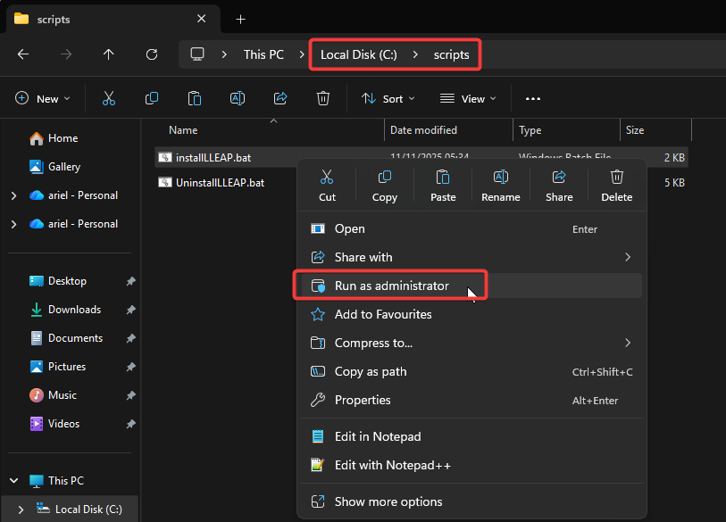
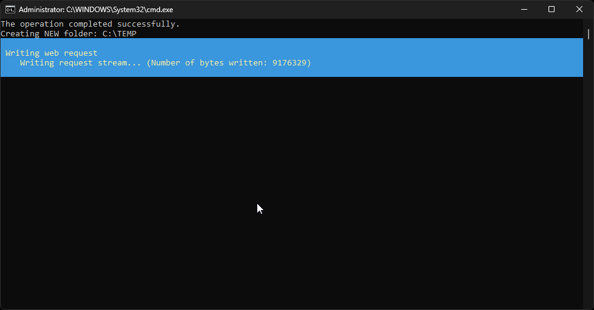
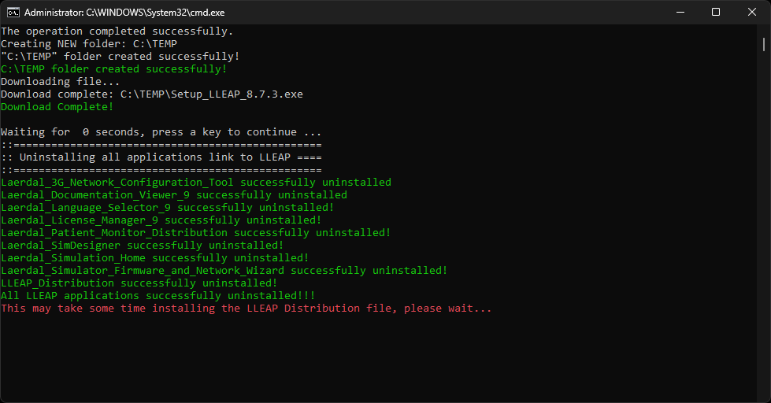
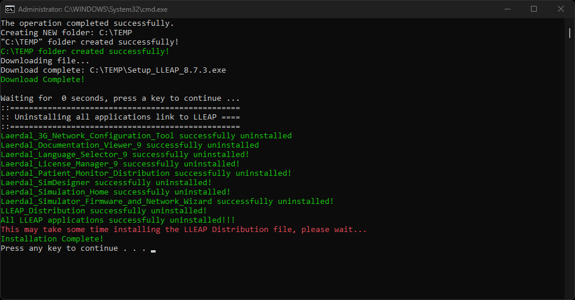
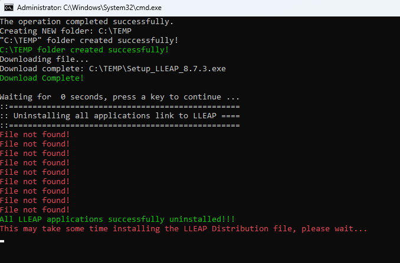
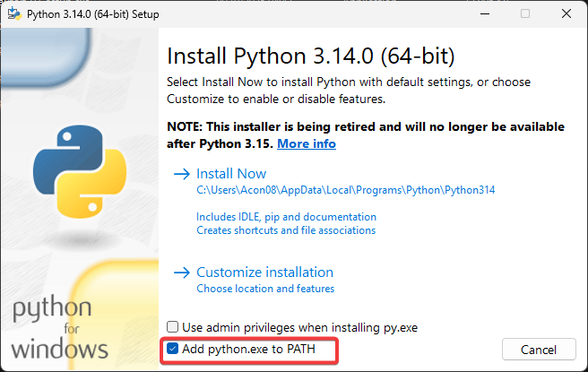
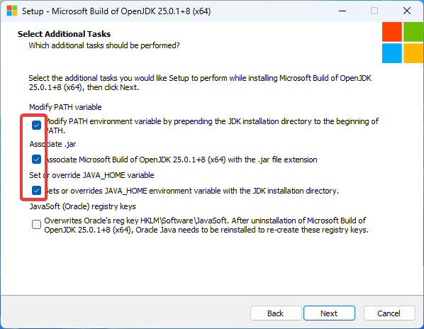

# $${\color{red}LLEAP \space \color{lightblue}- \space \color{lightgreen}Assignment}$$

## This is my first Automation project use to test some functionalities of LLEAP application

## Required Softwares and Libraries:

1. The application uses python 3.14 and I havent tested with a different version lower than 3.14
2. Sikuli RobotFramework library
3. Pycharm IDE, VS Code can also be use in this application
4. LLEAP application version 8.7.3
5. Microsoft OpenJDK
All the required Softwares can be downloaded from the links below under **Downloadable files needed to run this application**

# Steps to install the LLEAP application
Installation of **LLEAP application** can be automated using the `installLLEAP.bat` file found in the scripts folder. All you need to do is copy the **`scripts`** folder into your `C:\` drive. Once the **`scripts`** folder is in your `C:\` drive then open the folder and run the `installLLEAP.bat` file as Administrator. It should be look like the image below.

# Below images are how suppose to be look like when you run the `installLLEAP.bat`file
## $${\color{green}{1. \space Downloading \space the \space file \space from \space the \space web}}$$ 

## $${\color{green}{2. \space LLEAP \space uninstallation \space complete }}$$ 

## $${\color{green}{3. \space LLEAP \space installation \space complete }}$$ 

## $${\color{green}{4. \space When \space there's \space no \space LLEAP \space installed \space in \space your \space machine }}$$ 

## What's Next? ##
Once you're done installing the LLEAP application, the next thing you're going to do is download and install the following Softrwares:
> 1. Python Application
> 2. Microsoft OpenJDK
> 3. Pycharm / or Visual Studio
> 4. SikulixIDE (_Optional_)

All mentioned softwares needed are available under Downloadable files below.

# Important note:
> [!IMPORTANT]
> 1. When installing your python, dont forget to tick the box _Add python.exe to PATH_. This will add the python.exe to System variables path.
> 
> 
>
> 2. When installing the Microsoft OpenJDK dont forget to tick the boxes thatsays `Modify PATH environment`, `Associate Micorosft Build with OpenJDK`and
>    `Sets or oeverrides JAVA_HOME environment variable`or you can refer on the image below.
>    
> 

## Setting up your IDE environment ##
After you download or clone the repository, Open your preferred IDE. (_for me i use Pycharm_)
1. When you first launch Pycharm you will the same image as below or slightly similar since i already use Pycharm so I dont get the Readme file or What's new.
2. Click on the Open icon and then open the folder or repository that you have cloned.
3. Look for the folder that you've downloaded and then click on `Select Folder`
   
# Downloadable files needed to run this application

LLEAP Application download link:
https://cdn.laerdal.com/downloads/f7618/Setup\_LLEAP\_8.7.3.exe

SikuliX IDE download link:
https://launchpad.net/sikuli/sikulix/2.0.5/+download/sikulixide-2.0.5.jar

Pycharm IDE download link:
https://www.jetbrains.com/pycharm/download/download-thanks.html?platform=windows

VS Code Editor download link:
https://code.visualstudio.com/sha/download?build=stable\&os=win32-x64-user

Python download link:
https://www.python.org/ftp/python/3.14.0/python-3.14.0-amd64.exe

Microsoft OpenJDK download link:
https://aka.ms/download-jdk/microsoft-jdk-25.0.1-windows-x64.exe

# References:

Link to Sikuli Library Documentation:
https://marketsquare.github.io/robotframework-SikuliLibrary/docs/SikuliLibrary.html

