# $${\color{red}LLEAP \space \color{lightblue}- \space \color{lightgreen}Assignment}$$

## This is my first Automation project use to test some functionalities of LLEAP application

## Required Softwares and Libraries:

1. The application uses python 3.14 and I havent tested with a different version lower than 3.14
2. Sikuli RobotFramework library
3. Pycharm IDE, VS Code can also be use in this application
4. LLEAP application version 8.7.3
5. Microsoft OpenJDK
All the required Softwares can be downloaded from the links below under **Downloadable files needed to run this application**

# Steps to install the LLEAP application
Installation of **LLEAP application** can be automated using the `installLLEAP.bat` file found in the scripts folder. All you need to do is copy the **`scripts`** folder into your `C:\` drive. Once the **`scripts`** folder is in your `C:\` drive then open the folder and run the `installLLEAP.bat` file as Administrator. It should be look like the image below.

# Below images are how suppose to be look like when you run the `installLLEAP.bat`file
## $${\color{green}{1. \space Downloading \space the \space file \space from \space the \space web}}$$ 

## $${\color{green}{2. \space LLEAP \space uninstallation \space complete }}$$ 

## $${\color{green}{3. \space LLEAP \space installation \space complete }}$$ 

## $${\color{green}{4. \space When \space there's \space no \space LLEAP \space installed \space in \space your \space machine }}$$ 

## What's Next? ##
Once you're done installing the LLEAP application, the next thing you're going to do is download and install the following Softrwares:
> 1. Python Application
> 2. Microsoft OpenJDK
> 3. Pycharm / or Visual Studio
> 4. SikulixIDE (_Optional_)

All mentioned softwares needed are available under Downloadable files below.

# Important note:
> [!IMPORTANT]
> 1. When installing your python, dont forget to tick the box _Add python.exe to PATH_. This will add the python.exe to System variables path.
> 
> 
>
> 2. When installing the Microsoft OpenJDK dont forget to tick the boxes thatsays `Modify PATH environment`, `Associate Micorosft Build with OpenJDK`and
>    `Sets or oeverrides JAVA_HOME environment variable`or you can refer on the image below.
>    
> 

## Setting up your IDE environment ##
After you download or clone the repository, Open your preferred IDE. (_for me i use Pycharm_)
1. When you first launch Pycharm application you will get into the Welcome to Pycharm screen window.
   
   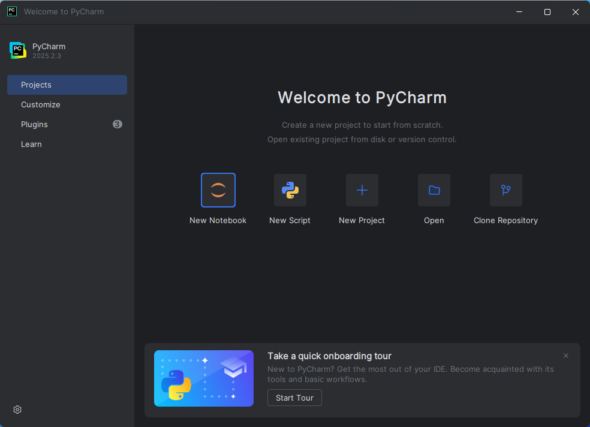
    
2. Click on the Open icon button.
   
   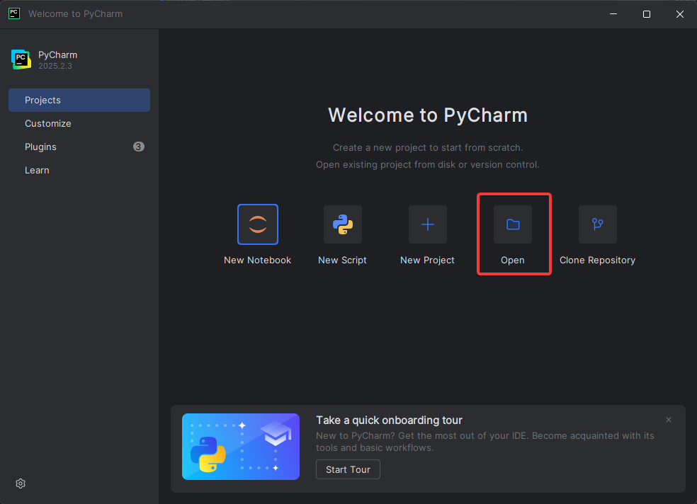
   
3. Look for the folder that you've downloaded and then click on `Select Folder`

   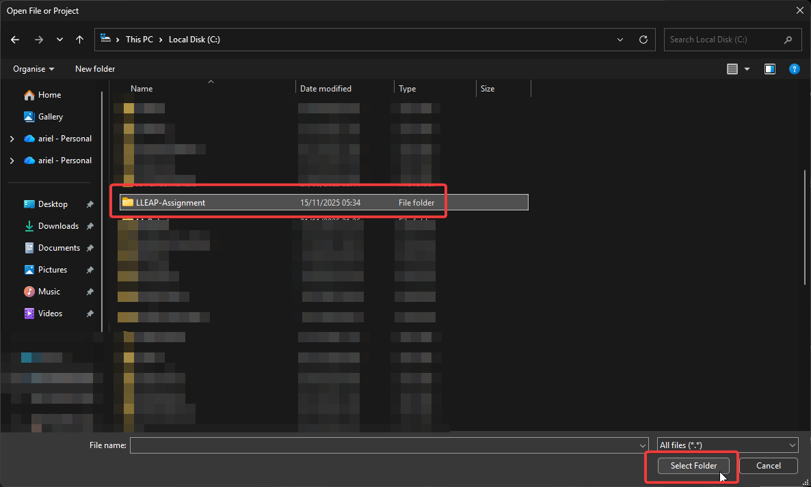

4. A Trust and Open Project 'LLEAP-Assignment' window is shown, Click on `Trust Project`.

   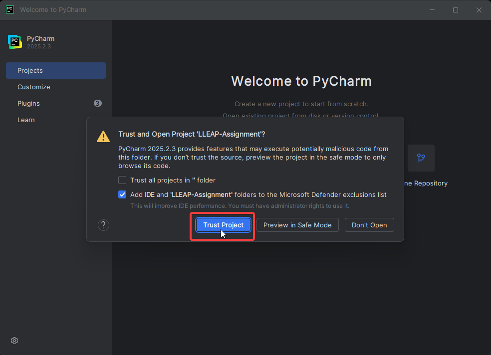

5. You will see then on What's new in Pycharm 2025.2  window, with all your LLEAP-Assignment files are shown in the left side of your screen below the Project folder.

   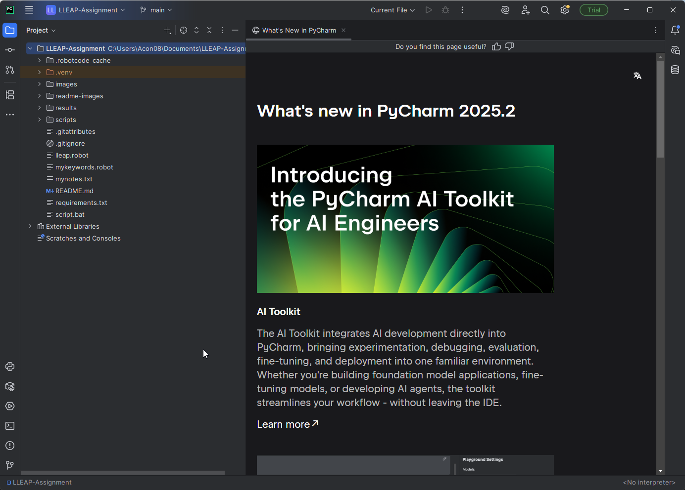

# Setting up your environment variable and configuring your Python interpreter.
1. In your pycharm window, click on the Terminal icon.
   
   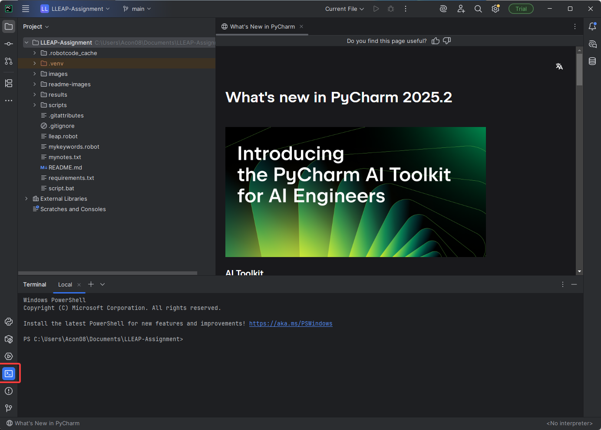

2. In the terminal window type in the command `python -m venv .venv` and press Enter.

   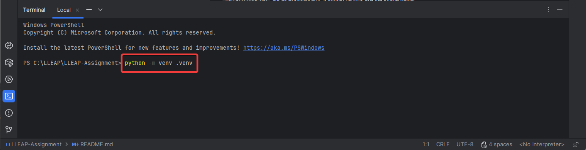

3. This will create a `.venv` folder use to store your Python virtual environment.

   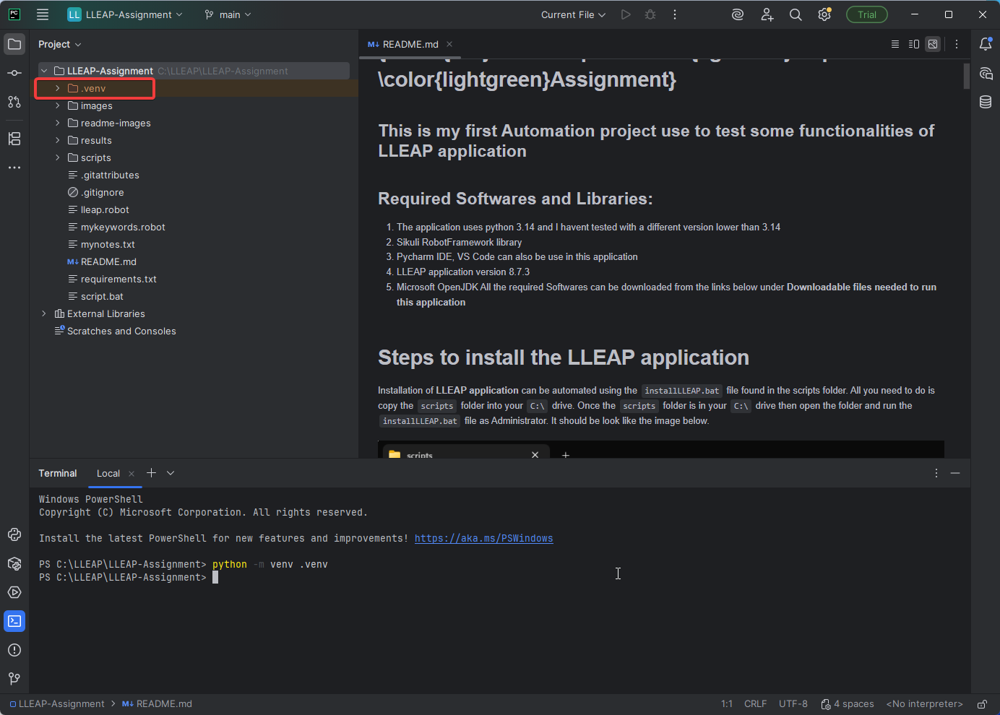

4. In the terminal window type in the command `.\.venv\Scripts\activate.bat`, this will activate your python environment.

   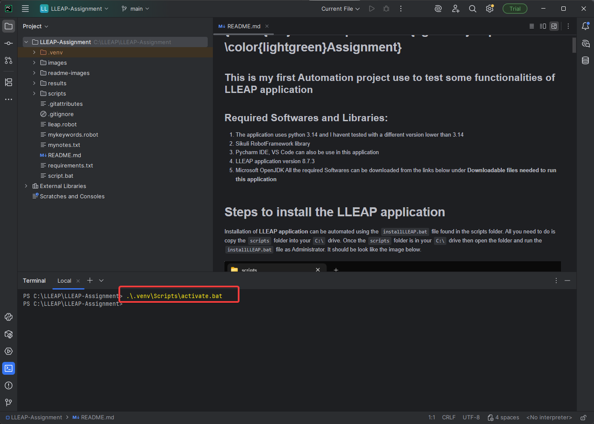

5. Once your environment variable is activate then you need to add your python interpreter. Press CTRL + ALT + S on your keyboard.
   Under Python click on the small drop won arrow and click `Interpreter`. Next click on `Add Interpreter`->`Add Local Interpreter`

    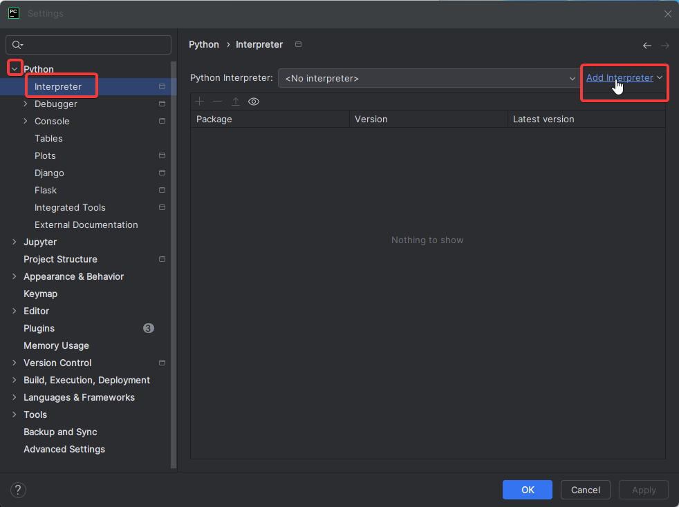

6. You will get a pop up regardign `Add Python Interpreter`. Click on `Select existing interpreter`then click `OK`-> `Apply`then `Ok`.

      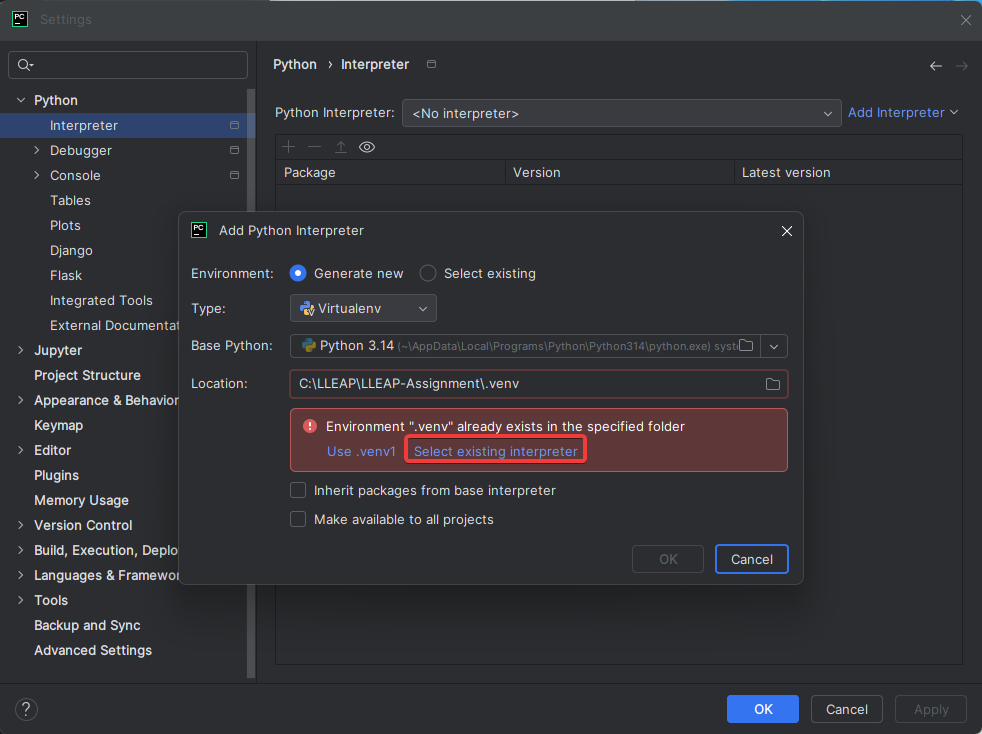 

7. Next in the terminal window type in the command `pip install -r requirements.txt`, this will install all the plugins required to run this application.

   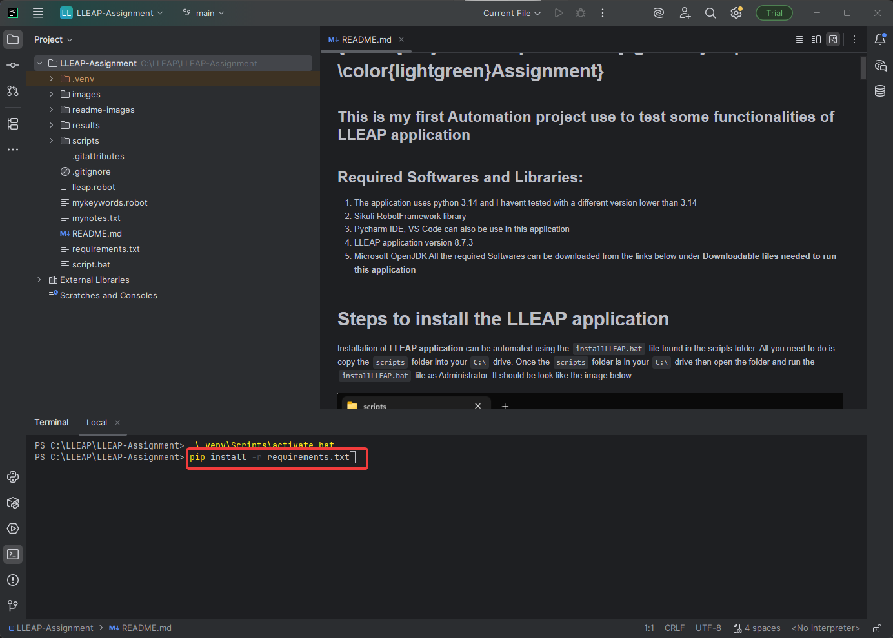

# How to use the application 
To use the application, simply type in the command `robot -d results lleap.robot`in the terminal, the application will then run automatically.
This application test the following features listed below:

## Test Case 1 that has been implemented 

> 1) Start Laerdal Simulation Home
>
> 2) Click on the Instructor Application.
> 
> 3) When requested to add the license, click on “Add license later”
>
> 4)  Click on the Local Computer tile in the Virtual Simulator section.
>
> 5)  Click on SimMan3G Plus
>
> 6) Click on the Manual Mode
> 
> 7) Expand the list of Themes.
> 
> 8) Click on the Healthy Patient theme.
> 
> 9) Click on the OK button in the bottom right corner of the UI.
> 
> 10) Click on the Start Session
> 
> 11) Maximize the window.
> 
> 12) For the Eyes control, select the “Closed” option.
> 
> 13) For the Lung compliance, change the value of the slider to 67%.
> 
> 14) On the Patient monitor (top right area of US with information about vitals), click on the HR value, and change it to one hundred.
> 
> 15) For the Voices, select the Coughing and play it once.
> 
> 16) Close the application using the “X” button.
> 
> 

# Downloadable files needed to run this application

LLEAP Application download link:
https://cdn.laerdal.com/downloads/f7618/Setup\_LLEAP\_8.7.3.exe

SikuliX IDE download link:
https://launchpad.net/sikuli/sikulix/2.0.5/+download/sikulixide-2.0.5.jar

Pycharm IDE download link:
https://www.jetbrains.com/pycharm/download/download-thanks.html?platform=windows

VS Code Editor download link:
https://code.visualstudio.com/sha/download?build=stable\&os=win32-x64-user

Python download link:
https://www.python.org/ftp/python/3.14.0/python-3.14.0-amd64.exe

Microsoft OpenJDK download link:
https://aka.ms/download-jdk/microsoft-jdk-25.0.1-windows-x64.exe

# References:

Link to Sikuli Library Documentation:
https://marketsquare.github.io/robotframework-SikuliLibrary/docs/SikuliLibrary.html

